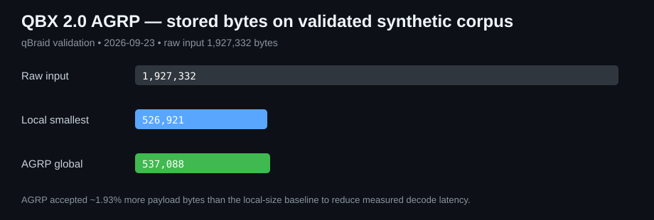
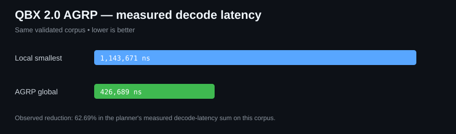

# QBX 2.0

[](https://github.com/MukaSanches/QBX/actions/workflows/ci.yml)
[](https://github.com/MukaSanches/QBX/actions/workflows/build-windows.yml)

QBX 2.0 is an experimental adaptive archive engine for Windows and Python. It combines content-defined chunking, global SHA-256 deduplication, multiple block representations and **AGRP — Adaptive Global Representation Planner**.

The product does not require quantum hardware. Quantum/QUBO work remains a research path for the planning problem.

## What is new in 2.0

QBX 1.x selected the smallest acceptable representation block by block. QBX 2.0 adds a global planning layer:

```
files
  -> content-defined chunks
  -> SHA-256 deduplication
  -> RAW / Zstandard / Deflate / LZMA candidates
  -> measured encode/decode latency
  -> Pareto pruning
  -> AGRP global goal-constrained planning
  -> QBX container
  -> full SHA-256 verification on extraction
```

The `adaptive` profile is now the default in the Windows GUI and CLI.

## Scientific validation

The research prototype was validated on qBraid on 2026-09-23. A small exact optimization problem was mapped to QUBO and exhaustively enumerated:

- 18 QUBO variables;
- 262,144 states examined;
- exact objective: `0.25243298047920626`;
- QUBO objective: `0.25243298047920626`;
- equivalence: **true**.

That result validates the tested mapping. It does **not** demonstrate quantum advantage.

### AGRP trade-off benchmark

On the validated 12-block synthetic corpus, the local-smallest plan stored 526,921 payload bytes with a measured decode sum of 1,143,671 ns. AGRP stored 537,088 bytes and reduced the measured decode sum to 426,689 ns.





Observed on that corpus:

- payload size delta: **+1.93%** versus local-smallest;
- measured decode-latency reduction: **62.69%**;
- peak dynamic-planner frontier: **60 states**;
- planner validation runtime: **5.003 s**.

These figures are dataset- and machine-specific observations, not universal performance claims. Raw data is stored in [benchmarks/results/qbraid_agrp_validation_2026-09-23.json](benchmarks/results/qbraid_agrp_validation_2026-09-23.json). See [docs/SCIENCE_V2.md](docs/SCIENCE_V2.md).

## Windows downloads

The Windows workflow builds:

- `QBX-Setup-2.0.0.exe` — graphical installer;
- `QBX-Portable-2.0.0.zip` — portable GUI + CLI;
- `SHA256SUMS.txt` — integrity hashes.

The installer associates `.qbx` files with the graphical application. The binaries are currently not code-signed, so Windows SmartScreen may show an unknown-publisher warning.

## GUI

The graphical application supports:

- selecting a file or folder;
- `adaptive`, `fast`, `balanced` and `smallest` profiles;
- creating a QBX archive;
- inspecting archive contents;
- full integrity verification;
- safe extraction.

`adaptive` runs AGRP. The older profiles remain available when predictable compression behavior or lower packing overhead is preferred.

## CLI

Install from source:

```bash
python -m pip install -e .
```

Create with AGRP:

```bash
qbx pack MyFolder MyArchive.qbx --profile adaptive
```

Optional global budgets:

```bash
qbx pack MyFolder MyArchive.qbx --profile adaptive --max-size-mb 500 --max-decode-ms 250
```

Traditional profiles:

```bash
qbx pack MyFolder MyArchive.qbx --profile fast
qbx pack MyFolder MyArchive.qbx --profile balanced
qbx pack MyFolder MyArchive.qbx --profile smallest
```

Verify, inspect and extract:

```bash
qbx verify MyArchive.qbx
qbx list MyArchive.qbx
qbx unpack MyArchive.qbx RestoredFolder
```

Existing destination files are not overwritten unless `--overwrite` is explicitly supplied.

## How AGRP works

For each unique block, QBX 2.0 measures a candidate set containing RAW, multiple Zstandard levels, Deflate levels and LZMA levels. It removes representations that are simultaneously worse in stored size, encode latency and decode latency.

The remaining Pareto candidates are fed to a bounded global dynamic planner. By default, the planner derives a local-smallest baseline, allows a small size budget above that baseline, and searches for a lower-latency global combination. User-supplied size/decode budgets override the defaults.

Planner metadata is embedded in the archive manifest so the decision process can be inspected with `qbx list`.

## Reproducible product benchmark

Run:

```bash
python benchmarks/v2_benchmark.py
```

It generates a deterministic corpus and compares:

- QBX balanced;
- QBX smallest;
- QBX adaptive AGRP;
- ZIP/Deflate level 9.

Every QBX result is verified and extracted, and the reconstructed tree hash must match the source before the benchmark succeeds.

## Integrity and safety

QBX uses:

- SHA-256 block identity;
- SHA-256 reconstructed-file verification;
- global block deduplication;
- safe relative-path validation;
- refusal to overwrite by default;
- bounded manifest/block limits;
- atomic archive writes;
- atomic extracted-file replacement.

QBX 2.0 is still an experimental format implementation. Keep independent copies of important data until it has broader interoperability testing, fuzzing and independent security review.

## Quantum research

The planner problem can be represented as QUBO/Ising for QAOA and other solvers. The archive format itself remains fully classical and can always be decoded without a QPU.

No claim of quantum advantage is made.

## Development

Run the test suite:

```bash
python -m pip install -e ".[dev]"
python -m pytest -q
```

Windows CI also builds and self-tests the GUI and CLI executables before uploading artifacts.

## License

MIT.
